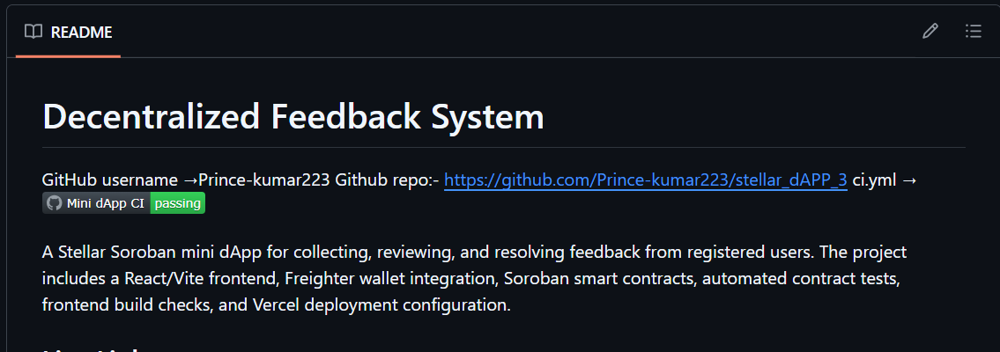

# Decentralized Feedback System
GitHub username →Prince-kumar223
Github repo:- https://github.com/Prince-kumar223/stellar_dAPP_3
ci.yml → [](https://github.com/Prince-kumar223/stellar_dAPP_3/actions/workflows/ci.yml)


A Stellar Soroban mini dApp for collecting, reviewing, and resolving feedback from registered users. The project includes a React/Vite frontend, Freighter wallet integration, Soroban smart contracts, automated contract tests, frontend build checks, and Vercel deployment configuration.

## Live Links

- Live deployed link:-  https://stellar-d-app-3.vercel.app/
- Demo video Link :- https://youtu.be/wEEcnQmigcs
- GitHub repository:-  https://github.com/Prince-kumar223/stellar_dAPP_3


## Deployed contract ID

FEEDBACK_CONTRACT_ID:- CDZHE5WGQXSJIV7VKNNTMOU5MEJ26PRPNUUDQZC2GTMZ7CTC3AZKV2WZ
USER_REGISTRY_CONTRACT_ID:- CBT77CDDODCT5NWEC2JPIQGIFE4VOS5KIDJIFOFAYI6HF2R4S32W5HUV
TRANSACTION_HASH:-733b190b3ccd0c86ca3a75e2faaec57143922a0c10221522dffec0553749ad6c

## SCREENSHOT:-
Mobile responsive UI:-


CI/CD pipeline running:- 

Test output with 3+ passing tests:- 


## Features

- Connect and reconnect a Freighter wallet.
- Register users through the admin-controlled user registry contract.
- Submit feedback from registered users.
- View feedback records with status, author, and timestamps.
- Admin workflow for reviewing and resolving feedback.
- Configurable Stellar testnet/mainnet network settings through Vite environment variables.
- Rust contract tests for Soroban logic.
- Frontend tests, linting, and production build scripts.
- GitHub Actions CI for contract tests and frontend builds.
- Vercel deployment from the repository root.

## Tech Stack

- Frontend: React, Vite, Tailwind CSS, lucide-react
- Wallet: Freighter Wallet API
- Blockchain: Stellar Soroban
- Smart contracts: Rust, soroban-sdk
- Tests: Cargo test, Vitest, Testing Library
- CI/CD: GitHub Actions and Vercel

## Project Structure

```text
stellar_dAPP_3/
|-- .github/
|   `-- workflows/
|       `-- ci.yml
|-- contract/
|   |-- feedback-contract/
|   |   |-- src/
|   |   |   |-- lib.rs
|   |   |   `-- test.rs
|   |   `-- Cargo.toml
|   |-- user-registry-contract/
|   |   |-- src/
|   |   |   |-- lib.rs
|   |   |   `-- test.rs
|   |   `-- Cargo.toml
|   |-- Cargo.toml
|   `-- Cargo.lock
|-- frontend/
|   |-- src/
|   |   |-- components/
|   |   |-- config/
|   |   |-- hooks/
|   |   |-- pages/
|   |   |-- services/
|   |   |-- App.jsx
|   |   `-- main.jsx
|   |-- package.json
|   |-- package-lock.json
|   `-- vite.config.js
|-- docs/
|   `-- test-output.md
|-- scripts/
|   |-- deploy-contract.ps1
|   `-- deploy-contract.sh
|-- SUBMISSION_CHECKLIST.md
|-- vercel.json
`-- README.md
```

## Prerequisites

- Node.js 20+
- npm
- Rust stable toolchain
- Soroban/Stellar CLI for contract build and deployment
- Freighter browser wallet
- Stellar testnet account funded with testnet XLM

## Environment Variables

Create `frontend/.env` for local development and configure the same values in Vercel for deployment.


Optional tuning variables:

```env
VITE_STELLAR_BASE_FEE=100
VITE_STELLAR_TX_TIMEOUT=30
VITE_REFRESH_INTERVAL_MS=12000
VITE_TX_POLL_INTERVAL_MS=1200
VITE_MAX_FEEDBACK_PROBE_ID=50
```

## Run Locally

Install frontend dependencies:

```bash
cd frontend
npm ci
```

Start the frontend:

```bash
npm run dev
```

Build the frontend:

```bash
npm run build
```

Run frontend tests:

```bash
npm run test
```

Run frontend lint checks:

```bash
npm run lint
```

Run smart contract tests:

```bash
cd ../contract
cargo test --workspace
```

## Smart Contracts

The contract workspace contains two Soroban contracts:

- `feedback-contract`: stores feedback, tracks status, and supports admin review and resolution.
- `user-registry-contract`: stores registered users and controls who can submit feedback.

Main feedback flow:

1. Admin initializes the registry and feedback contracts.
2. Admin registers a user.
3. Registered user submits feedback.
4. Admin reviews pending feedback.
5. Admin resolves reviewed feedback.

## Deployment

This repository is configured for Vercel with [vercel.json](vercel.json):

```json
{
  "framework": "vite",
  "installCommand": "npm ci --prefix frontend",
  "buildCommand": "npm run build --prefix frontend",
  "outputDirectory": "frontend/dist"
}
```

Recommended Vercel setup:

- Connect the GitHub repository to Vercel.
- Keep the project root as the repository root.
- Add all required `VITE_` environment variables in Vercel.
- Push to `main` or `master` to trigger production deployment.

## CI/CD

GitHub Actions workflow: [.github/workflows/ci.yml](.github/workflows/ci.yml)

The CI pipeline runs on pushes and pull requests targeting `main` or `master`.

Jobs:

- `test-contracts`: installs Rust, restores Cargo cache, and runs `cargo test --workspace` in `contract`.
- `build-frontend`: installs Node.js 20, runs `npm ci`, and builds the Vite frontend in `frontend`.

Current delivery flow:

```text
push to GitHub
-> GitHub Actions validates contracts and frontend build
-> Vercel builds frontend/dist
-> Vercel deploys the live app
```

## Test Status
cargo test: 3 passed, 0 failed
Demo flow:

1. Open the deployed app.
2. Connect Freighter.
3. Register a user as admin.
4. Submit feedback from a registered wallet.
5. Review and resolve feedback from the admin view.

## Submission Checklist

See [SUBMISSION_CHECKLIST.md](SUBMISSION_CHECKLIST.md) for the final project checklist.
